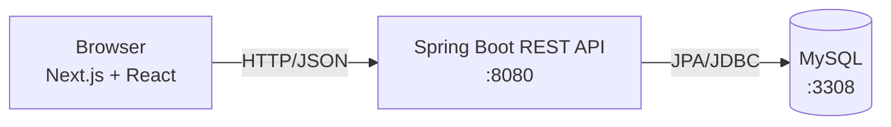

# Fittracker

A small full-stack web app where users register, log in, and keep a personal journal of free-form notes.

> **About this project**
> Fittracker is a school project built to learn a production-grade backend stack end-to-end. Spring Boot, JPA, REST APIs, and MySQL running in Docker.
>
> The original idea was a fitness/training tracker (hence the name), but the implemented scope landed closer to a generic per-user note-taker: any user can keep a list of free-form text entries. The data model and UI don't enforce a fitness shape on the content.
>
> The Next.js frontend is intentionally minimal. It exists to exercise the API, not as a UI showcase. The project is feature-complete for its original learning goals.

## Features

- User registration and login
- Per-user note journal (create, list, delete free-form text entries)
- REST API with versioned routes (`/api/users`, `/api/notes`)
- Persistent storage in MySQL via Spring Data JPA
- Containerized database via Docker Compose for one-command local setup

## Tech stack

| Layer    | Technology                                       |
| -------- | ------------------------------------------------ |
| Backend  | Java 21, Spring Boot 3.5, Spring Data JPA, Maven |
| Frontend | Next.js 16, React 19, Tailwind CSS 4             |
| Database | MySQL 8 (Docker)                                 |
| Tooling  | Docker Compose, Maven Wrapper, ESLint            |

## Architecture



The frontend is a Next.js app that calls the Spring Boot REST API. The API persists users and training notes to MySQL through Spring Data JPA repositories.

## Project structure

```
fittracker/
├── backend/             # Spring Boot REST API
│   └── src/main/java/com/fittracker/Fittracker/
│       ├── controller/  # REST endpoints
│       ├── service/     # business logic
│       ├── repository/  # JPA repositories
│       └── model/       # entities (User, Note)
├── frontend/            # Next.js app (App Router)
│   └── app/
│       ├── login/
│       ├── register/
│       ├── dashboard/
│       └── components/
└── docker-compose.yaml  # MySQL container
```

## What I learned

- Building a layered Spring Boot application: controller → service → repository → entity.
- Designing a small REST API and consuming it from a separate frontend, including handling CORS.
- Mapping a relational schema with JPA entities and managing schema evolution via `spring.jpa.hibernate.ddl-auto`.
- Running a database locally with Docker Compose and connecting a Spring Boot app to it.
- Coordinating two services (frontend + backend) on different ports during development.

## Running locally

### Prerequisites

- Docker Desktop
- Java 21 (or use the bundled `mvnw` wrapper)
- Node.js 18+ and `pnpm` (or `npm`)

### 1. Start the database

From the repo root:

```bash
docker compose up -d
```

This launches MySQL 8 on `localhost:3308` with database `fittracker-db`.

### 2. Start the backend

```bash
cd backend
./mvnw spring-boot:run
```

The API runs on `http://localhost:8080`.

### 3. Start the frontend

```bash
cd frontend
pnpm install
pnpm dev
```

Open `http://localhost:3000`.

### Useful commands

```bash
docker compose logs -f db   # tail database logs
docker compose down         # stop the database
docker compose down -v      # stop and wipe the database volume
```

## Known limitations

This is a finished school project, not a production application. Looking back, the things I would do differently or improve in a follow-up:

- **Authentication is a stub.** Passwords are stored in plaintext and the frontend keeps the user id in `localStorage`. A real version should hash with BCrypt and use Spring Security with JWT or session cookies.
- **No automated tests** beyond the default Spring Boot smoke test. Controller and service tests should come next.
- **No CI pipeline.** A GitHub Actions workflow running `mvn test` and `next build` would be a small but worthwhile addition.
- **Configuration is hardcoded.** API URL and database credentials belong in environment variables, with an `.env.example` checked in.
- **Frontend was deliberately minimal.** It's a thin client over the API; styling and UX were not the focus of this project.

## License

MIT
