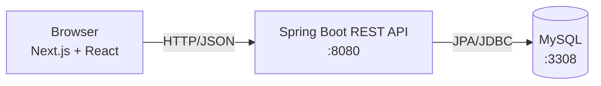

# Fittracker

A simple full-stack fitness-tracker web app where users can register, log in, and keep a journal of their training sessions.

Built as a learning project to practice a real production stack end-to-end: a Java/Spring Boot REST API, a Next.js/React frontend, and a MySQL database running in Docker.

## Features

- User registration and login
- Per-user training journal (create, list, delete notes)
- REST API with versioned routes (`/api/users`, `/api/notes`)
- Persistent storage in MySQL with JPA-managed schema
- Containerized database via Docker Compose for one-command local setup

## Tech stack

| Layer    | Technology                                    |
| -------- | --------------------------------------------- |
| Backend  | Java 21, Spring Boot 3.5, Spring Data JPA, Maven |
| Frontend | Next.js 16, React 19, Tailwind CSS 4          |
| Database | MySQL 8 (Docker)                              |
| Tooling  | Docker Compose, Maven Wrapper, ESLint         |

## Architecture



The frontend is a Next.js app that calls the Spring Boot REST API.
The API persists users and training notes to MySQL through Spring Data JPA repositories.

## Project structure

```
fittracker/
├── backend/             # Spring Boot REST API
│   └── src/main/java/com/fittracker/Fittracker/
│       ├── controller/  # REST endpoints
│       ├── service/     # business logic
│       ├── repository/  # JPA repositories
│       └── model/       # entities (User, Note)
├── frontend/            # Next.js app (App Router)
│   └── app/
│       ├── login/
│       ├── register/
│       ├── dashboard/
│       └── components/
└── docker-compose.yaml  # MySQL container
```

## Running locally

### Prerequisites

- Docker Desktop
- Java 21 (or use the bundled `mvnw` wrapper)
- Node.js 18+ and `pnpm` (or `npm`)

### 1. Start the database

From the repo root:

```bash
docker compose up -d
```

This launches MySQL 8 on `localhost:3308` with database `fittracker-db`.

### 2. Start the backend

```bash
cd backend
./mvnw spring-boot:run
```

The API runs on `http://localhost:8080`.

### 3. Start the frontend

```bash
cd frontend
pnpm install
pnpm dev
```

Open `http://localhost:3000`.

### Useful commands

```bash
docker compose logs -f db   # tail database logs
docker compose down         # stop the database
docker compose down -v      # stop and wipe the database volume
```

## Roadmap & known limitations

This is an active learning project. Things I'm aware of and plan to improve:

- **Authentication is a stub.** Passwords are stored in plaintext and the frontend uses `localStorage` for session state. Next: hash passwords with BCrypt and switch to Spring Security with JWT or session cookies.
- **No automated tests** beyond the default Spring Boot smoke test. Adding controller and service tests is next on the list.
- **No CI pipeline** yet — planning a GitHub Actions workflow to run `mvn test` and `next build` on each push.
- **Configuration is hardcoded.** API URL and database credentials should move to environment variables and an `.env.example`.
- **No live demo yet.** Goal: deploy backend on Render/Railway and frontend on Vercel.

## License

MIT
